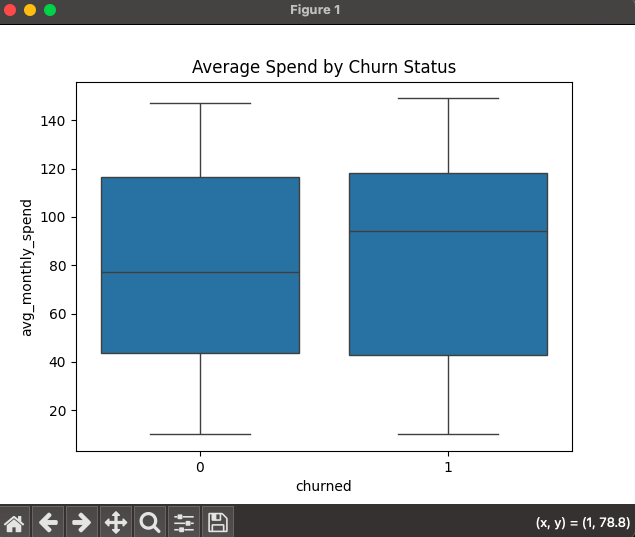

# starbucks-churn-analysis
Predicting customer churn using synthetic Starbucks data and evaluating the model's accuracy with precision and recall.

# Features
* generates synthetic Starbucks customer data
* analyzes patterns
* builds a churn prediction model using Python, pandas, scikit-learn, and Seaborn.

# Files
* generate_data.py — generates synthetic customer data
* churn_analysis.py — analyzes data and builds a churn model
* starbucks_customers.csv — generated customer dataset
* README.md — project documentation

# Key Insights
* Customers with fewer monthly visits and low reward balances are more likely to churn.
* Loyal customers with more visits + higher rewards have lower churn risk.

# Tech Stack
* Python
* pandas, numpy
* scikit-learn
* matplotlib, seaborn

# How to Run
1. Install required libraries: pip install pandas numpy scikit-learn matplotlib seaborn
2. Generate the dataset:
python3 generate_data.py
3. Run analysis: python3 churn_analysis.py

# Visual Graphs

This boxplot compares the average monthly spending of customers who churned versus those who stayed. The distributions are almost identical, showing that spending behavior does not significantly differ between the two groups. Key takeaway:  Average spend is not a useful predictor of churn.

This scatter plot visualizes visit frequency and reward points while highlighting churned customers. Most churned customers cluster around lower visit counts, while high-frequency visitors rarely churn. Reward points do not show a strong pattern. Key takeaway: Low visit frequency is strongly associated with churn; rewards alone are not.
